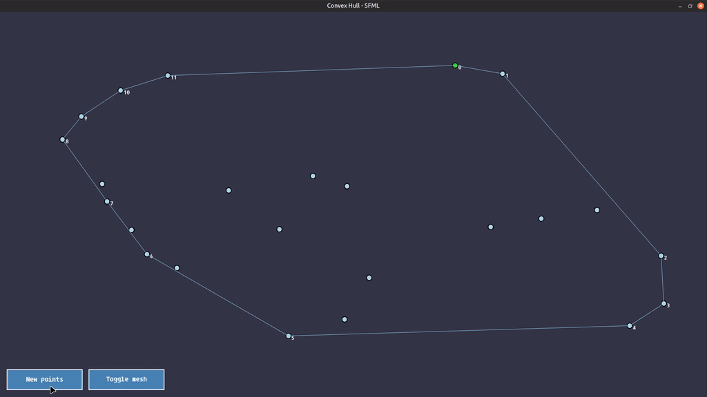
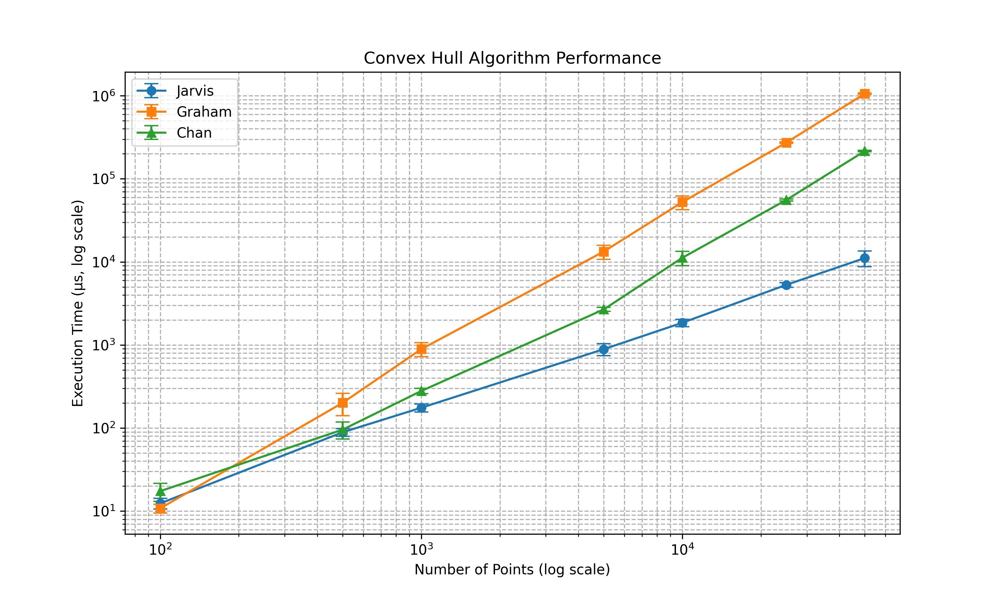
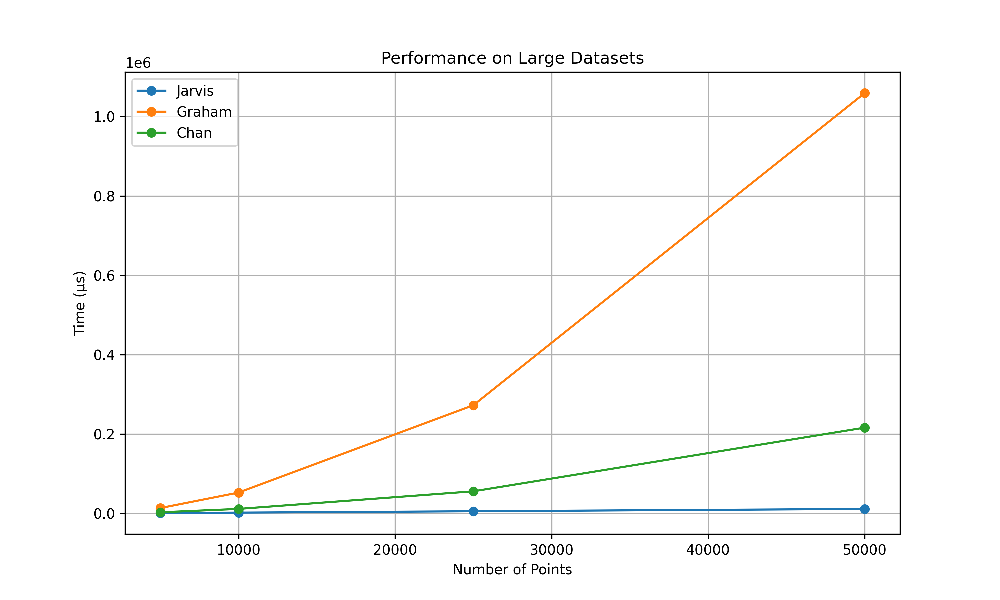
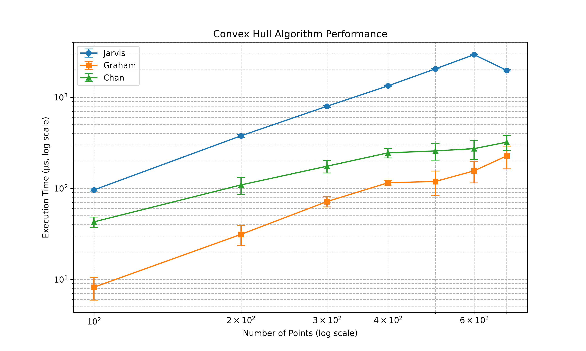

[](https://classroom.github.com/a/ouojHGwW)
# АиСД
## Семестровая работа по алгоритмам

Необходимо выполнить задание согласно выбранному варианту (согласовывается с преподавателем).
Реализация СД должна быть выполнена на языке программирования C++.

Также необходимо подготовить презентацию по выбранному алгоритму (Плюсы, минусы, особенности, для чего используется)

---

### Convex Hull Chan Algorithm:


---

### Random Point Statistics:



---

### Circular Point Statistics:


---

### **Build and Run SFML Application**
Compiles and executes the SFML graphics program:
```bash
make sfml
# Or use the default target:
make
```

---

### **Generate and View Statistics**
Compiles and runs the statistics module:
```bash
make stats
```

---

### **Generate Plots**
Visualize results using Python (requires `plot_results.py` dependencies):
```bash
make plot
```

---

### **Debug Build**
Compile the SFML application with debug symbols (no optimizations):
```bash
make debug
# Run the debug executable manually:
./dbg
```

---

### **Clean Build Artifacts**
Remove compiled binaries:
```bash
make clean
```

---

### Prerequisites
Ensure these dependencies are installed:
- **Compiler**: `g++` (supports C++20)
- **SFML Libraries**: `libsfml-graphics`, `libsfml-window`, `libsfml-system`
- **Python**: `python3` + dependencies for `plot_results.py` (likely `matplotlib`/`pandas`)

---

### Installation Notes
**SFML Setup (Ubuntu example)**:
```bash
sudo apt install g++ libsfml-dev
```

**Python Dependencies**:
```bash
pip3 install matplotlib pandas  # Adjust as needed for plot_results.py
```

---

### Project Structure
Key files in the repository:
- `sfml.cpp`: SFML application source
- `stats.cpp`: Statistics processing program
- `plot_results.py`: Results visualization script
- `Makefile`: Build automation (this guide)
